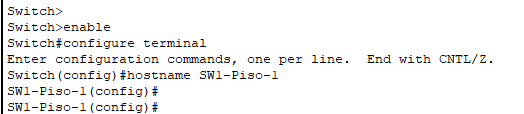
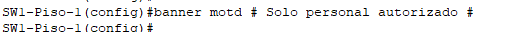

# **Clase 11: Configuración Básica de un Switch II**

## **1. Modos de Comandos en un Switch**
Cisco IOS tiene diferentes **modos de operación**, cada uno con permisos y funcionalidades específicas.

### **1.1. Modo de Ejecución de Usuario**
- **Útil para operaciones básicas** como monitoreo de estado del dispositivo.
- **No permite modificar la configuración del switch**.
- **Se identifica con el símbolo `>`**.
- **Ejemplo**:
  ```plaintext
  Switch>
  ```

### **1.2. Modo de Ejecución Privilegiada**
- Permite **ejecutar comandos avanzados** y ver configuraciones detalladas.
- **Se identifica con el símbolo `#`**.
- Para cambiar del **Modo de Usuario** al **Modo Privilegiado**, se usa:
  ```bash
  enable
  ```
- Para regresar al **Modo de Usuario**, se usa:
  ```bash
  disable
  ```
- **Ejemplo**:
  ```plaintext
  Switch#
  ```

### **1.3. Modo de Configuración Global**
- Permite realizar **cambios en la configuración del dispositivo**.
- **Se identifica por la palabra `config` seguida de `#`**.
- Para ingresar:
  ```bash
  configure terminal
  ```
- Para salir, se usa:
  ```bash
  exit
  ```
  o la combinación de teclas:
  ```plaintext
  Ctrl + Z
  ```
- **Ejemplo**:
  ```plaintext
  S1(config)#
  ```

---

## **2. Configuración del Nombre del Dispositivo**
El nombre del switch por **defecto es `Switch`**, pero se recomienda cambiarlo a un nombre **más descriptivo**.

📌 **Comando para cambiar el nombre del switch:**
```bash
hostname NOMBRE_DEL_SWITCH
```
📌 **Ejemplo de configuración:**
```bash
Switch(config)# hostname S1
S1(config)#
```

📌 **Ejemplo visual:**


---

## **3. Configuración de un Banner MOTD**
Para **informar que solo personal autorizado puede acceder al switch**, se usa un **banner MOTD (Message of the Day).**

📌 **Comando para configurar un banner MOTD:**
```bash
banner motd # Mensaje de advertencia #
```
📌 **Ejemplo de configuración:**
```bash
Switch(config)# banner motd # Acceso restringido. Solo usuarios autorizados. #
```

📌 **Ejemplo visual de configuración del banner MOTD:**


📌 **Ejemplo de salida del banner MOTD al acceder al switch:**


---

## **4. Resumen**
- **Modos de comandos:**
  - **Modo Usuario (`>`)** → Comandos básicos de monitoreo.
  - **Modo Privilegiado (`#`)** → Acceso a configuraciones avanzadas (`enable` para acceder, `disable` para salir).
  - **Modo Configuración Global (`config#`)** → Modificación de configuración (`configure terminal` para acceder, `exit` o `Ctrl+Z` para salir).
- **Cambio de nombre del switch** con el comando `hostname`.
- **Implementación de un banner MOTD** con el comando `banner motd`.

