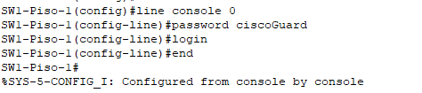
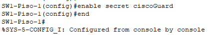
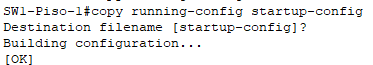
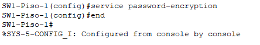

# **Clase 12: Configuración Básica de un Switch III**

## **1. Seguridad en el Acceso a un Switch**
Por defecto, los switches permiten **acceso total** desde el **puerto de consola**, lo que significa que cualquier usuario puede ingresar sin restricciones.  
📌 **Es crucial establecer contraseñas** para restringir el acceso administrativo y proteger la configuración del dispositivo.

---

## **2. Configuración de Contraseña para el Modo de Usuario**
Para proteger el acceso al **modo de ejecución de usuario**, se debe configurar una contraseña en la línea de consola.

📌 **Comandos para establecer la contraseña en el Modo de Usuario:**
```bash
Switch(config)# line console 0
Switch(config-line)# password CLAVE
Switch(config-line)# login  # Habilita la solicitud de contraseña
```

📌 **Ejemplo visual:**



---

## **3. Configuración de Contraseña para el Modo Privilegiado**
Para restringir el acceso al **Modo de Ejecución Privilegiado**, se usa el comando `enable secret`.

📌 **Comando para establecer la contraseña en el Modo Privilegiado:**

```bash
Switch(config)# enable secret CLAVE
```

📌 **Ejemplo visual:**



---

## **4. Archivos de Configuración en un Switch**
Cisco IOS maneja dos archivos principales para almacenar la configuración:

| Archivo | Ubicación | Característica |
|---------|-----------|--------------|
| **running-config** | **RAM** | Contiene la configuración actual. Se pierde al reiniciar. |
| **startup-config** | **NVRAM** | Configuración almacenada para reinicios. |

### **4.1. Guardar la Configuración Actual**
Para evitar perder la configuración al reiniciar el switch, se debe copiar el archivo `running-config` en `startup-config`.

📌 **Comando para guardar la configuración en NVRAM:**

```bash
Switch# copy running-config startup-config
```

📌 **Ejemplo visual:**



---

## **5. Visualización de la Configuración**
Para verificar la configuración almacenada en la RAM (**running-config**) y en la NVRAM (**startup-config**):

📌 **Ver configuración actual en RAM:**

```bash
Switch# show running-config
```

📌 **Ver configuración almacenada en NVRAM:**

```bash
Switch# show startup-config
```

---

## **6. Encriptación de Contraseñas**
Las contraseñas configuradas en el switch aparecen en **texto plano**, lo que representa un **riesgo de seguridad**. Para encriptarlas, se usa el comando `service password-encryption`.

📌 **Comando para encriptar todas las contraseñas en texto plano:**

```bash
Switch(config)# service password-encryption
```

📌 **Ejemplo visual:**



---

## **7. Ejemplo de Startup Config Luego de Configuraciones Básicas**
Después de realizar estas configuraciones básicas, el archivo **startup-config** mostrará las contraseñas encriptadas y la configuración persistente.

📌 **Ejemplo visual:**

```bash
SW1-Piso-1#show startup-config 
Using 1213 bytes
!
version 15.0
no service timestamps log datetime msec
no service timestamps debug datetime msec
service password-encryption
!
hostname SW1-Piso-1
!
enable secret 5 $1$mERr$MBUmOC8uPfTqwsXFsUyqj/
!
!
!
!
!
!
spanning-tree mode pvst
spanning-tree extend system-id
!
interface FastEthernet0/1
!
interface FastEthernet0/2
!
interface FastEthernet0/3
!
interface FastEthernet0/4
!
interface FastEthernet0/5
!
interface FastEthernet0/6
!
interface FastEthernet0/7
!
interface FastEthernet0/8
!
interface FastEthernet0/9
!
interface FastEthernet0/10
!
interface FastEthernet0/11
!
interface FastEthernet0/12
!
interface FastEthernet0/13
!
interface FastEthernet0/14
!
interface FastEthernet0/15
!
interface FastEthernet0/16
!
interface FastEthernet0/17
!
interface FastEthernet0/18
!
interface FastEthernet0/19
!
interface FastEthernet0/20
!
interface FastEthernet0/21
!
interface FastEthernet0/22
!
interface FastEthernet0/23
!
interface FastEthernet0/24
!
interface GigabitEthernet0/1
!
interface GigabitEthernet0/2
!
interface Vlan1
 no ip address
 shutdown
!
banner motd ^C Solo personal autorizado ^C
!
!
!
line con 0
 password 7 0822455D0A162202131908
 login
!
line vty 0 4
 login
line vty 5 15
 login
!
!
!
!
end
```

---

## **8. Resumen**
- **Es importante proteger el acceso al switch** mediante contraseñas.
- **Modo de Usuario:** Se protege con `line console 0` y `password`.
- **Modo Privilegiado:** Se protege con `enable secret`.
- **La configuración debe guardarse** con `copy running-config startup-config`.
- **Las contraseñas deben encriptarse** con `service password-encryption`.

---
