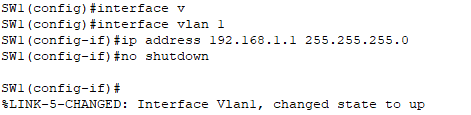
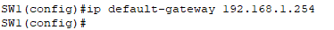
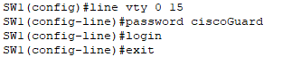
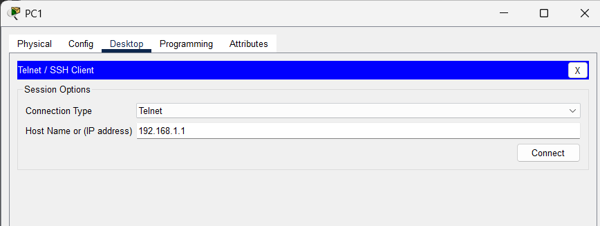
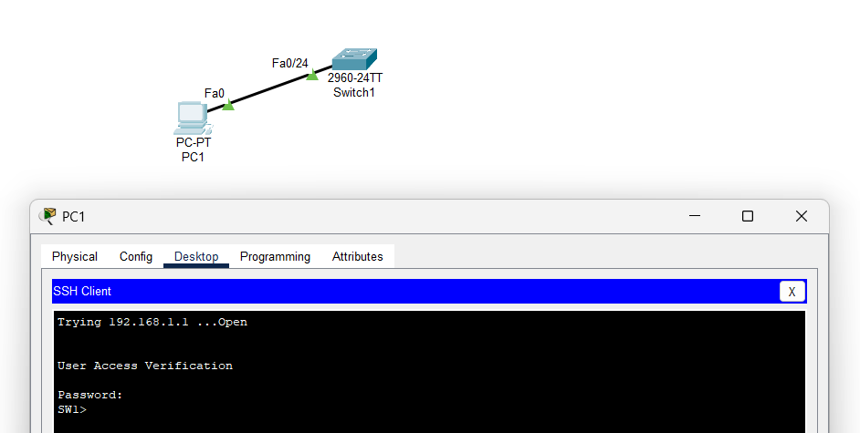

# **Clase 13: Configuración Básica de un Switch IV**

## **1. Interfaces en un Switch Cisco de Capa 2**
Los switches de **capa 2** de Cisco cuentan con **puertos físicos** para conectar dispositivos, pero **estos puertos no soportan direcciones IP de capa 3**.

### **1.1. Interfaces Virtuales SVI**
- Los switches de **capa 2** incluyen **Interfaces Virtuales de Switch (SVI)** que permiten asignar direcciones IP para su administración remota.
- Los switches **no necesitan direcciones IP** para su funcionamiento normal, pero sí para **administración remota**.
- **Todas las interfaces están asignadas por defecto a VLAN 1**.
- **Por defecto**, los switches incluyen la interfaz `VLAN 1`, que permite el **envío y recepción de tramas de administración** en cualquier puerto asignado a VLAN 1.

---

## **2. Administración Remota de un Switch**
Para permitir la administración remota del switch, se debe configurar una **dirección IP** y una **máscara de subred** en la **SVI de VLAN 1**.

📌 **Comandos para asignar una dirección IP a `VLAN 1`:**

```bash
Switch(config)# interface vlan 1
Switch(config-if)# ip address [IP] [MÁSCARA]
Switch(config-if)# no shutdown
```

📌 **Ejemplo visual:**



---

## **3. Configuración del Gateway por Defecto**

Cuando se asigna una dirección IP a la **SVI** del switch, también se debe configurar un **default-gateway**, que es la dirección IP de un router que permitirá **acceder al switch desde una red remota**.

📌 **Comando para configurar el `default-gateway`:**

```bash
Switch(config)# ip default-gateway [IP]
```

📌 **Ejemplo visual:**



---

## **4. Configuración de Acceso Remoto (VTY)**
Los **líneas VTY (Virtual Terminal Lines)** permiten el **acceso remoto a la CLI del switch** utilizando protocolos como **Telnet o SSH**.  
Los switches Cisco **soportan hasta 16 líneas de terminal virtual**.

📌 **Comandos para configurar VTY en el switch:**

```bash
Switch(config)# line vty 0 15
Switch(config-line)# password [CLAVE]
Switch(config-line)# login
```
📌 **Nota:**  
- **Por defecto, Telnet está habilitado**.
- Para mayor seguridad, se recomienda usar **SSH en lugar de Telnet**.

📌 **Ejemplo visual:**



---

## **5. Implementación y Prueba de Acceso Remoto**
### **5.1. Intento de Ingreso mediante Telnet desde una PC**
📌 **Ejemplo visual:**



---

### **5.2. Acceso Correcto mediante Telnet**
📌 **Ejemplo visual:**



---

## **6. Resumen**
- **Los switches de capa 2 no soportan direcciones IP en sus puertos físicos**, pero pueden configurarse con **interfaces virtuales (SVI)**.
- La **SVI de VLAN 1** permite la administración remota del switch con una **dirección IP** y **máscara de subred**.
- Se debe configurar un **gateway por defecto** (`ip default-gateway`) para permitir la administración desde redes remotas.
- **Las líneas VTY (`line vty 0 15`)** permiten acceder al switch remotamente mediante **Telnet o SSH**.
- Se recomienda **usar SSH en lugar de Telnet** por razones de seguridad.

---

