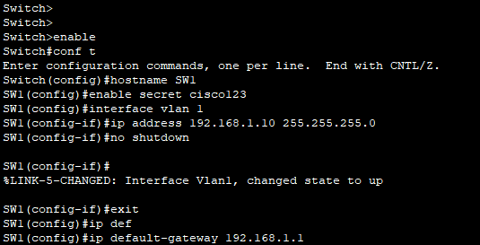
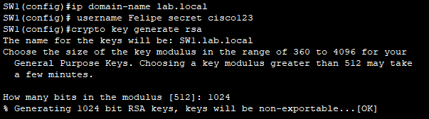
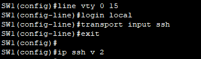
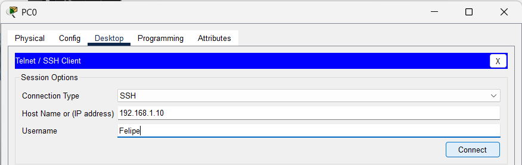
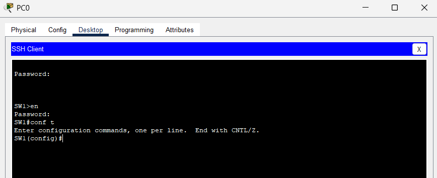
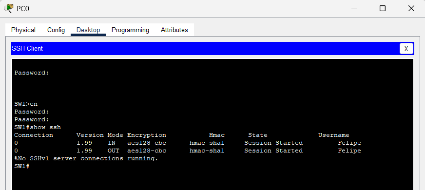

# **Clase 14: Configuración Básica de un Switch V**

## **1. Seguridad en el Acceso Remoto: SSH vs. Telnet**
El protocolo **Telnet** permite acceso remoto a los dispositivos, pero **no es seguro**, ya que los datos se transmiten **sin encriptar**.  
Se recomienda habilitar **SSH (Secure Shell)**, que cifra toda la comunicación entre el **cliente SSH** y el **servidor**, protegiendo contraseñas y datos sensibles.

---

## **2. Requisitos Previos para Habilitar SSH**
Antes de configurar **SSH** en el switch, se deben cumplir los siguientes requisitos:

📌 **Comandos requeridos antes de habilitar SSH:**
1. **Configurar una contraseña de acceso al modo privilegiado**:
   ```bash
   enable secret [PASSWORD]
   ```
2. **Configurar la interfaz VLAN 1 con una dirección IP y máscara de subred**:
   ```bash
   interface vlan 1
   ip address [IP] [MÁSCARA]
   no shutdown
   ```
3. **Definir un gateway por defecto (si se desea acceso remoto desde otra red)**:
   ```bash
   ip default-gateway [IP]
   ```

📌 **Ejemplo visual de la configuración previa:**



---

## **3. Configuración de SSH en un Switch Cisco**
Para habilitar **SSH**, se deben seguir estos pasos:

📌 **1. Configurar un nombre de host diferente al predeterminado (`Switch`)**
```bash
Switch(config)# hostname S1
```

📌 **2. Configurar un nombre de dominio**
```bash
S1(config)# ip domain-name [DOMINIO]
```

📌 **3. Generar un par de claves RSA (tamaño recomendado: 1024-2048 bits)**
```bash
S1(config)# crypto key generate rsa
  - Introducir tamaño de clave (Ej: 1024 o 2048)
```

📌 **4. Crear un usuario en la base de datos local del switch**
```bash
S1(config)# username [USUARIO] secret [PASSWORD]
```

📌 **Ejemplo visual de los pasos anteriores:**



---

## **4. Configuración de Acceso SSH en VTY**
Después de habilitar **SSH**, se debe configurar el acceso remoto en **VTY**:

📌 **1. Configurar las líneas VTY (Virtual Terminal Lines) para autenticación local**
```bash
S1(config)# line vty 0 15
S1(config-line)# login local
S1(config-line)# transport input ssh
S1(config-line)# exit
```

📌 **2. (Opcional) Especificar la versión de SSH**
```bash
S1(config)# ip ssh version 2
```

📌 **Ejemplo visual de la configuración de las líneas VTY:**



---

## **5. Prueba de Conexión SSH desde una PC**
Una vez configurado **SSH**, se debe probar la conectividad desde una PC con el comando:

📌 **Ejemplo de conexión desde una PC usando SSH:**
```bash
ssh -l [USUARIO] [IP_DEL_SWITCH]
```

📌 **Ejemplo visual del intento de conexión desde la PC:**



📌 **Ejemplo visual de una conexión SSH exitosa:**



---

## **6. Verificación de SSH en el Switch**
Para comprobar si **SSH** está activo y funcionando correctamente, se usa el siguiente comando:

📌 **Comando para verificar sesiones SSH activas:**
```bash
show ssh
```

📌 **Ejemplo visual de la verificación de SSH:**



---

## **7. Resumen**
- **Telnet no es seguro**, por lo que se recomienda **usar SSH** para administrar switches de forma remota.
- **SSH encripta la comunicación** entre el cliente y el switch, protegiendo contraseñas y datos.
- **Requisitos previos** para habilitar SSH:
  - **Configurar VLAN 1** con una IP y máscara de subred.
  - **Definir un nombre de dominio (`ip domain-name`)**.
  - **Generar claves RSA (`crypto key generate rsa`)**.
  - **Crear un usuario en la base de datos local (`username secret`)**.
- **Se debe configurar VTY (`line vty 0 15`)** para aceptar **SSH en lugar de Telnet**.
- **Se puede verificar SSH con el comando `show ssh`**.

---

