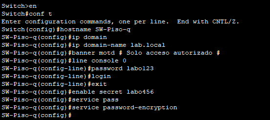
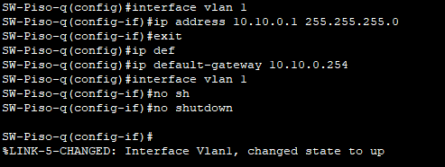
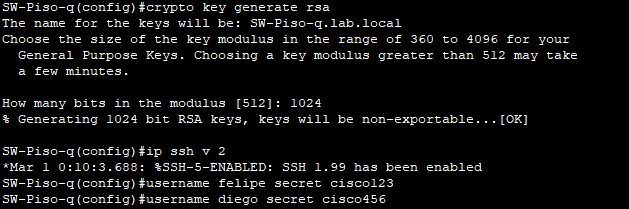
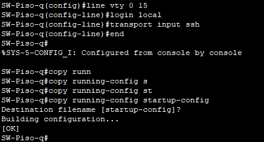
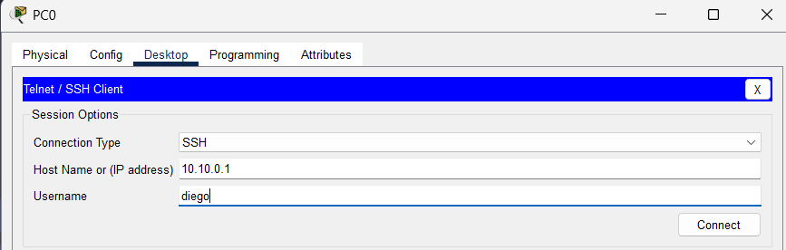
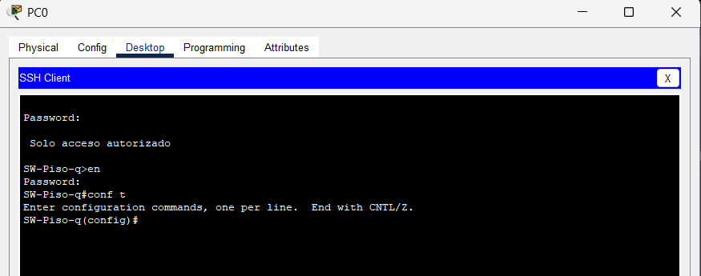

# **Clase 15: Configuración Básica de un Switch - Laboratorio**

## **1. Requerimientos del Laboratorio**
Se debe realizar la siguiente configuración en un switch:
- **Hostname**: `Sw-Piso-1`
- **Nombre de dominio**: `lab.local`
- **Banner MOTD** con mensaje de advertencia.
- **Contraseñas**:
  - **Modo Usuario**: `labo123`
  - **Modo Privilegiado**: `labo456`
- **Dirección IP y Máscara en VLAN 1**: `10.10.0.1/24`
- **Default Gateway**: `10.10.0.254`
- **Gestión remota por SSH**.
- **Usuarios creados en la base de datos local**:
  - `felipe:cisco123`
  - `diego:cisco456`

---

## **2. Configuración Inicial del Switch**
Se realiza la configuración del **hostname**, el **nombre de dominio**, las **contraseñas** y su **encriptación**.

📌 **Ejemplo de configuración:**
```bash
Switch(config)# hostname Sw-Piso-1
Sw-Piso-1(config)# ip domain-name lab.local
Sw-Piso-1(config)# banner motd #Acceso Restringido - Solo Usuarios Autorizados#
Sw-Piso-1(config)# enable secret labo456
Sw-Piso-1(config)# line console 0
Sw-Piso-1(config-line)# password labo123
Sw-Piso-1(config-line)# login
Sw-Piso-1(config)# service password-encryption
```

📌 **Ejemplo visual:**



---

## **3. Configuración de IP en la VLAN 1 y Gateway**
Se asigna una dirección IP a la interfaz VLAN 1 y se activa la interfaz.

📌 **Comandos para configurar IP y Gateway:**
```bash
Sw-Piso-1(config)# interface vlan 1
Sw-Piso-1(config-if)# ip address 10.10.0.1 255.255.255.0
Sw-Piso-1(config-if)# no shutdown
Sw-Piso-1(config)# ip default-gateway 10.10.0.254
```

📌 **Ejemplo visual:**



---

## **4. Configuración de SSH y Creación de Usuarios**
Se genera el par de claves **RSA**, se habilita **SSH versión 2** y se crean los usuarios en la base de datos local.

📌 **Comandos para configurar SSH y usuarios:**
```bash
Sw-Piso-1(config)# crypto key generate rsa
  - Tamaño recomendado: 1024 o 2048 bits
Sw-Piso-1(config)# ip ssh version 2
Sw-Piso-1(config)# username felipe secret cisco123
Sw-Piso-1(config)# username diego secret cisco456
```

📌 **Ejemplo visual:**



---

## **5. Configuración de Acceso Remoto en VTY y Guardado de Configuración**
Se configuran las líneas **VTY** para requerir autenticación local y solo permitir **SSH**.  
También se guarda la configuración en **NVRAM** para que sea persistente.

📌 **Comandos para configurar VTY y guardar configuración:**
```bash
Sw-Piso-1(config)# line vty 0 15
Sw-Piso-1(config-line)# login local
Sw-Piso-1(config-line)# transport input ssh
Sw-Piso-1(config-line)# end
Sw-Piso-1# copy running-config startup-config
```

📌 **Ejemplo visual:**



---

## **6. Prueba de Conectividad SSH**
### **6.1. Intento de Conexión desde la PC**
Desde la PC, se intenta acceder al switch utilizando **SSH**.

📌 **Ejemplo de comando en la PC:**
```bash
ssh -l felipe 10.10.0.1
```

📌 **Ejemplo visual del intento de conexión:**



---

### **6.2. Acceso Exitoso por SSH**
Después de ingresar el usuario y contraseña, se establece una **conexión SSH exitosa**.

📌 **Ejemplo visual del acceso exitoso:**



---

## **7. Resumen**
- Se configuró el switch con un **hostname**, **nombre de dominio** y **contraseñas** encriptadas.
- Se asignó una **dirección IP** a la **interfaz VLAN 1** y se configuró un **default-gateway**.
- Se habilitó **SSH** en lugar de **Telnet** para **mayor seguridad**.
- Se crearon **usuarios en la base de datos local** (`felipe` y `diego`).
- Se configuró **VTY para login local y solo permitir SSH**.
- Se realizó una **prueba de conectividad SSH** desde una PC con **conexión exitosa**.

---
