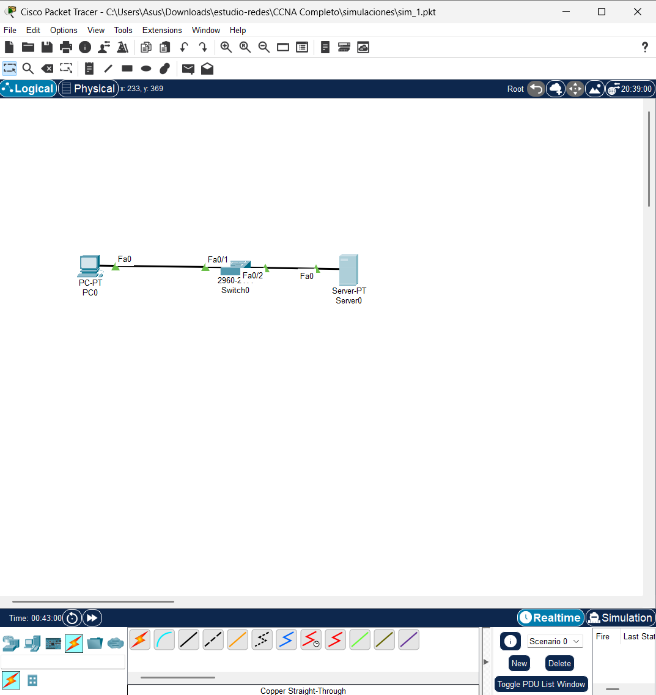
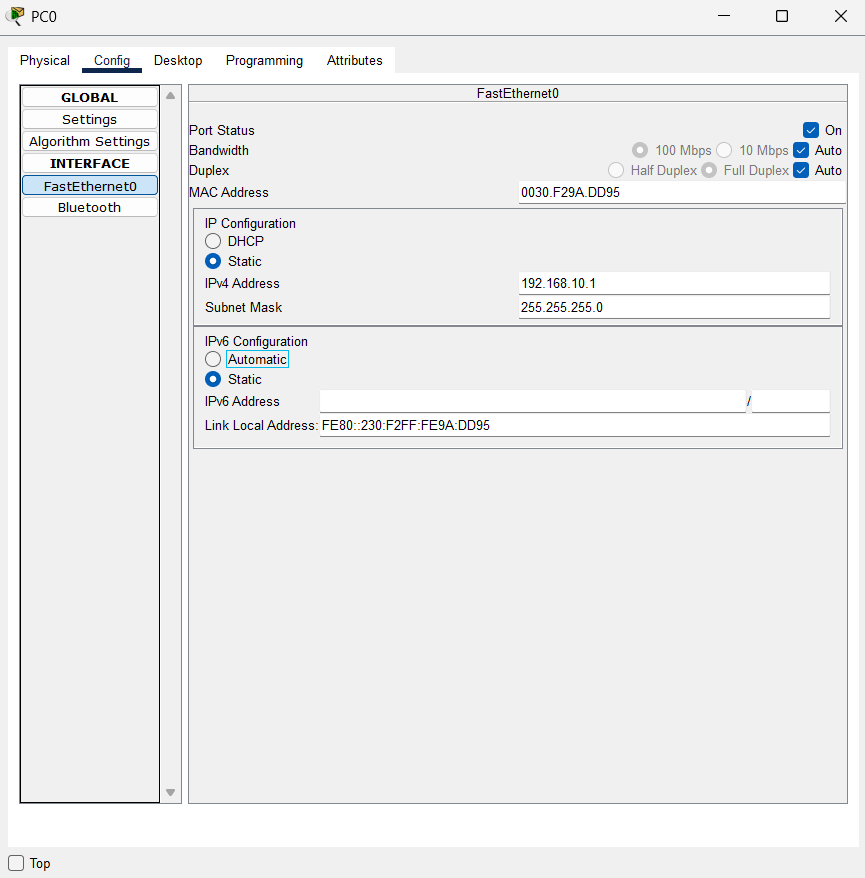
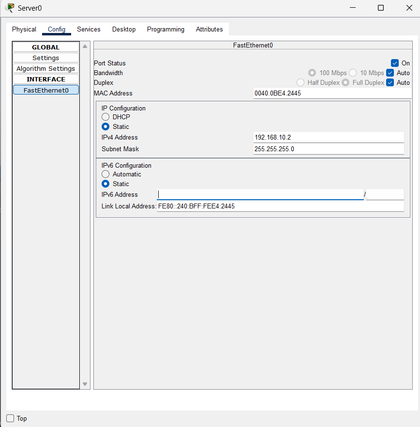
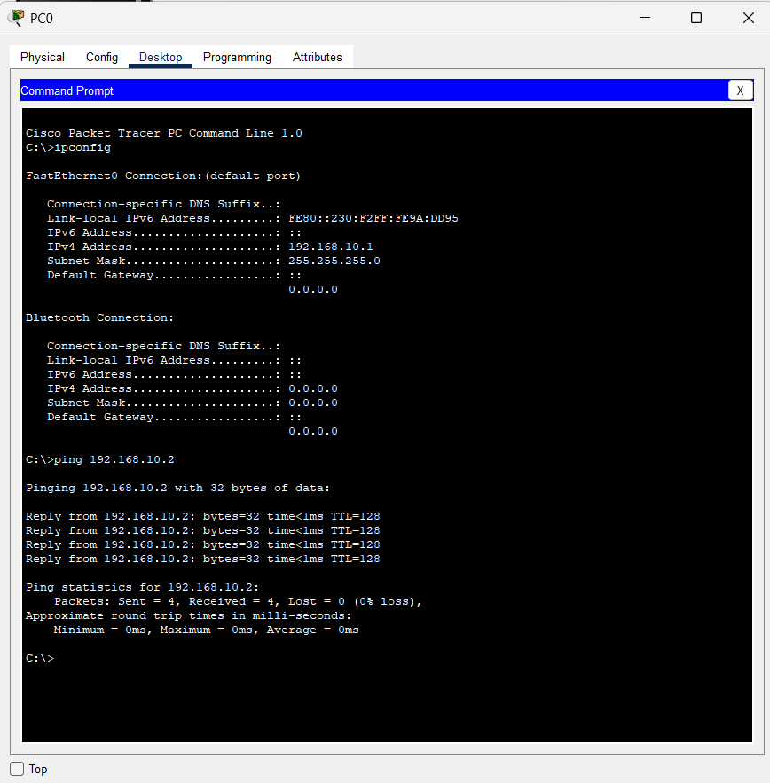

# **Clase 9: Simulador de Redes Packet Tracer**

## **1. Introducción a Packet Tracer**
**Packet Tracer** es un **simulador de redes** desarrollado por Cisco que permite a los usuarios:
- **Practicar** la configuración de dispositivos de red.
- **Desarrollar habilidades** en redes sin necesidad de hardware físico.
- **Simular entornos de redes** para pruebas y aprendizaje.

---

## **2. Simulación de una LAN Simple**

### 📌 **Diseño de LAN**

En esta simulación, se creará una red **LAN básica**, configurando **PCs y un servidor** con direcciones IP estáticas.

---

## **3. Configuración de Direcciones IP en los Dispositivos**

### 📌 **Asignar IP a una PC**

Cada PC en la red debe tener una dirección IP única dentro del mismo rango de red para comunicarse con otros dispositivos.

---

### 📌 **Asignar IP al Servidor**

El servidor también debe configurarse con una **IP estática**, ya que proporciona servicios de red como **DNS, HTTP o DHCP**.

---

## **4. Verificación de Configuración y Pruebas de Conectividad**

### 📌 **Comprobar Configuración con `ipconfig` y `ping`**

Para verificar la configuración de la red:
1. Ejecutar el comando `ipconfig` en la terminal de una PC para ver la dirección IP asignada.
2. Usar el comando `ping` para probar la conectividad entre dispositivos.

## **5. Resumen**
- **Packet Tracer** permite simular redes sin necesidad de hardware real.
- Se puede configurar una **LAN básica** asignando **IP estáticas** a PCs y servidores.
- Se usan comandos como **`ipconfig`** y **`ping`** para verificar la conectividad.
- Es una herramienta ideal para **practicar y desarrollar habilidades en redes**.
